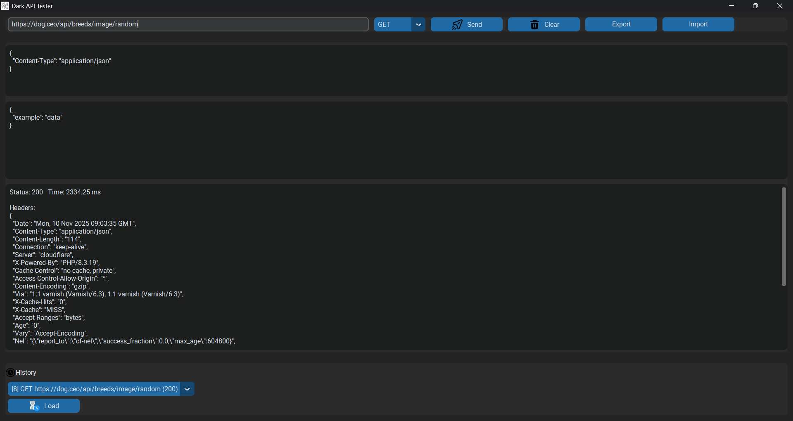
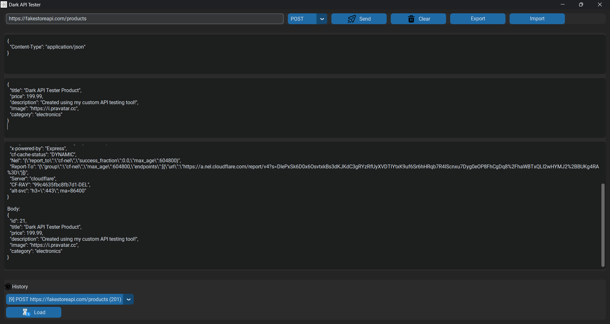
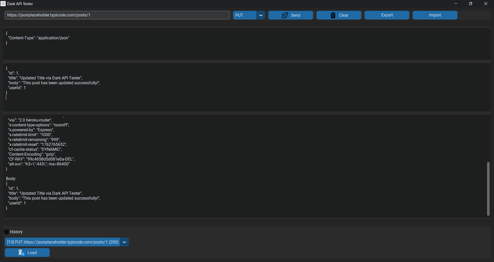
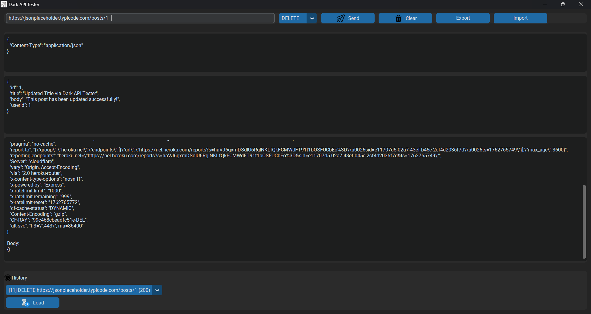

🌌 Dark API Tester

⚙️ A modern, Postman-style desktop application built in Python with CustomTkinter and Requests.
Beautifully designed with a sleek dark interface, intuitive icon buttons, JSON formatting, and a fully persistent history system — all packed into a standalone desktop app.

---

## 🖼️ Screenshots

| Section                 | Screenshot |
|------------------------ |-------------|
| 🏠 **Main Interface**  |  |
| ⚙️ **Operation_1**     |  |
| ⚙️ **Operation_2**     |  |
| ⚙️ **Operation_3**     |  |
| ⚙️ **Operation_4**     |  |
| 🕑 **History Panel**   |  |

---

## 📂 Project Structure

API_TESTER-PROJECT2/
└── Dark-API-Tester/
    ├── asserts/                       # All static resources (icons & screenshots)
    │   ├── icons/                     # Application icons used in UI and build
    │   │   ├── app.ico                # App and EXE icon
    │   │   ├── clear.png              # Clear button icon
    │   │   ├── history.png            # History button icon
    │   │   ├── load.png               # Load button icon
    │   │   ├── save.png               # Save button icon
    │   │   └── send.png               # Send/Execute button icon
    │   │
    │   └── screenshots/               # Screenshots for README / documentation
    │
    ├── build/                         # Temporary build files created by PyInstaller
    │   └── main/                      # Auto-generated build directory
    │
    ├── data/                          # Stores persistent data for history tracking
    │   ├── history.db                 # SQLite database for request history
    │   └── history.json               # JSON backup of history entries
    │
    ├── dist/                          # Final packaged application output
    │   ├── asserts/                   # Bundled assets copied into EXE build
    │   ├── data/                      # Bundled data folder
    │   └── main.exe                   # Standalone Windows executable
    │
    ├── ui/                            # UI (CustomTkinter) code and logic
    │   ├── __pycache__/               # Compiled Python bytecode
    │   └── main_window.py             # Core application logic and GUI layout
    │
    ├── venv/                          # Virtual environment (Python dependencies)
    │
    ├── .gitattributes                 # Git config for consistent line endings
    ├── build.bat                      # Build script (cleans & rebuilds EXE)
    ├── main.py                        # Entry point for launching the application
    ├── main.spec                      # PyInstaller specification file (auto-generated)
    ├── README.md                      # Project documentation (this file)
    └── requirements.txt               # Python dependencies for the project

---

## ✨ Features

✅ Clean **Dark Mode UI** using `customtkinter`  
✅ Supports **GET / POST / PUT / DELETE / PATCH** methods  
✅ Add **custom headers** and **JSON/raw request body**  
✅ View **status code, headers, response time**, and **formatted JSON**  
✅ Automatically saves all requests in **SQLite** and **JSON**  
✅ **History panel** to reload and re-run previous requests  
✅ **Threaded execution** – UI never freezes  
✅ **Beautiful icon-based buttons** (Send, Clear, Load, etc.)  
✅ **Export / Import History**- Export all your past API requests to a .json file or import them again for reuse on another device.
✅ Cross-platform: **Windows**

---

## 🧩 Tech Stack

| Component         | Technology |
|-------------------|-------------|
| Language          | Python 3.10+ |
| UI Framework      | [CustomTkinter](https://github.com/TomSchimansky/CustomTkinter) |
| HTTP Client       | [Requests](https://docs.python-requests.org/) |
| Database          | SQLite3 |
| Image Loader      | Pillow (PIL Fork) |
| Storage           | JSON + SQLite |

---

🚀 How to Run
1️⃣ Clone the repository

git clone https://github.com/Shreyanshjain1008/Dark-API-Tester.git
cd Dark-API-Tester

2️⃣ Create and activate virtual environment

python -m venv venv
venv\Scripts\activate

3️⃣ Install dependencies

pip install -r requirements.txt

4️⃣ Run the app

python main.py

🏗️ Build as Standalone EXE

To package the app into a standalone executable:

pyinstaller --onefile --noconsole --add-data "asserts;asserts" --add-data "data;data" --icon="asserts/icons/app.ico" main.py

## The built .exe will appear in:

dist/main.exe

✅ Double-click to run — no Python needed!

🌍 Example APIs for Testing
Method	URL	Description
GET	    https://dog.ceo/api/breeds/image/random	        Fetch a random dog image 🐶
POST	https://fakestoreapi.com/products	            Create a fake product 🛒
PUT	    https://jsonplaceholder.typicode.com/posts/1	Update a post ✏️
PATCH	https://jsonplaceholder.typicode.com/posts/1	Partially update a post 🧩
DELETE	https://jsonplaceholder.typicode.com/posts/1	Delete a resource 🗑️

💾 Data Storage Path

Your app automatically creates:

C:\Users\<YourName>\Documents\DarkAPITesterData\

containing:

history.db → SQLite database

history.json → Backup JSON copy

💡 Tips

🧹 Use Clear to reset all request fields.

🕑 Use Load Selected to re-execute an old request from history.

💾 Use Export / Import to share request collections.

🌐 Works even offline for local APIs (like http://localhost:5000).

🏆 Why You’ll Love It

✔️ Lightweight alternative to Postman
✔️ No sign-in or setup — plug & play
✔️ Persistent history you control
✔️ Dark mode + icons make it elegant
✔️ Single-file .exe = just double-click and test APIs!

👨‍💻 Author

Developed with ❤️ by Shreyansh Jain
💬 "Simplifying API testing with Python, one request at a time."