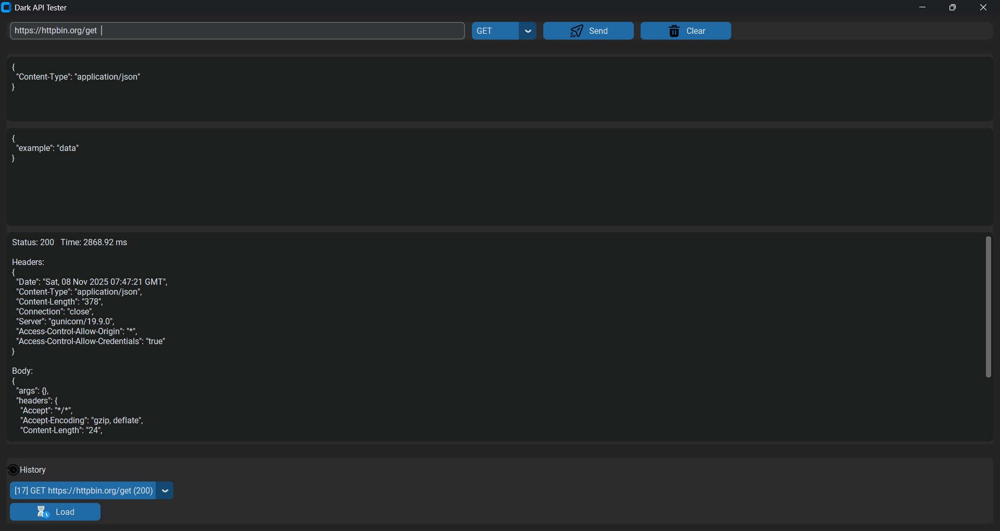
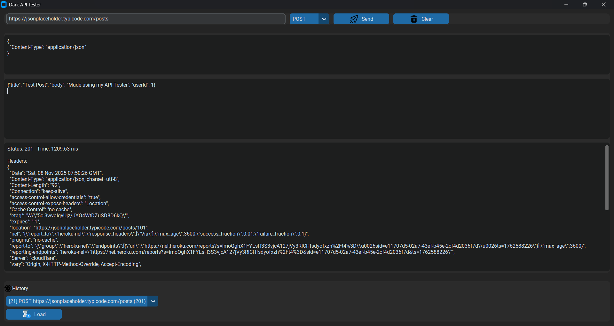
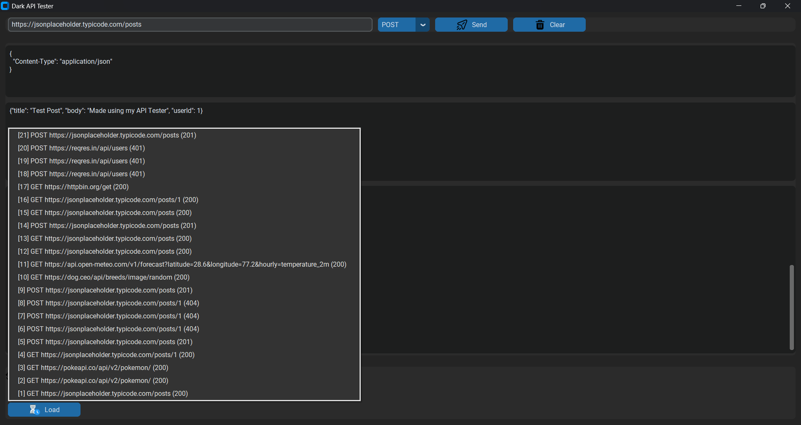

# Dark API Tester

A modern, Postman-style desktop application built with **Python**, **CustomTkinter**, and **Requests**, designed to make testing APIs simple, beautiful, and fast.  
This tool features a sleek **dark mode interface**, **icon-based buttons**, **request history**, and **JSON formatting** — all in one lightweight desktop app.

---

## 🖼️ Screenshots

| Section                 | Screenshot |
|------------------------ |-------------|
| 🏠 **Main Interface**  |  |
| ⚙️ **Send Request**    |  |
| ⚙️ **Send Request**    |  |
| 🕑 **History Panel**   |  |

---

## 📂 Project Structure

api_tester/
├── main.py
├── ui/
│ └── main_window.py
├── assets/
│ ├── icons/
│ │ ├── send.png
│ │ ├── clear.png
│ │ ├── save.png
│ │ ├── load.png
│ │ └── history.png
│ └── screenshots/
├── data/
│ ├── history.db
│ └── history.json
├── requirements.txt
└── README.md

---

## ✨ Features

✅ Clean **Dark Mode UI** using `customtkinter`  
✅ Supports **GET / POST / PUT / DELETE / PATCH** methods  
✅ Add **custom headers** and **JSON/raw request body**  
✅ View **status code, headers, response time**, and **formatted JSON**  
✅ Automatically saves all requests in **SQLite** and **JSON**  
✅ **History panel** to reload and re-run previous requests  
✅ **Threaded execution** – UI never freezes  
✅ **Beautiful icon-based buttons** (Send, Clear, Load, etc.)  
✅ Cross-platform: **Windows**

---

## 🧩 Tech Stack

| Component         | Technology |
|-------------------|-------------|
| Language          | Python 3.10+ |
| UI Framework      | [CustomTkinter](https://github.com/TomSchimansky/CustomTkinter) |
| HTTP Client       | [Requests](https://docs.python-requests.org/) |
| Database          | SQLite3 |
| Image Loader      | Pillow (PIL Fork) |
| Storage           | JSON + SQLite |

---

🧠 **Usage Guide**
▶️ Sending a Request

Enter an API URL (e.g., https://jsonplaceholder.typicode.com/posts)

Choose the HTTP Method (GET, POST, PUT, DELETE, PATCH)

Add request headers (as JSON or Key: Value lines)

Add an optional body (JSON or raw text)

Click the Send button 🚀

💬 Viewing the Response

The tool displays:

Status Code

Response Time (ms)

Response Headers

Formatted JSON Body

If the response is not JSON, it’s displayed as plain text.

🕑 Working with History

Every request and response is automatically saved to:

data/history.db (SQLite database)

data/history.json (JSON backup)

You can load and re-run old requests from the History panel.

🌍 Example APIs for Testing
🧪 JSONPlaceholder (Fake REST API)
Method                         URL	                     Description
GET	    https://jsonplaceholder.typicode.com/posts	    Get all posts
POST	https://jsonplaceholder.typicode.com/posts	    Create new post
PUT	    https://jsonplaceholder.typicode.com/posts/1	Update a post
DELETE	https://jsonplaceholder.typicode.com/posts/1	Delete a post